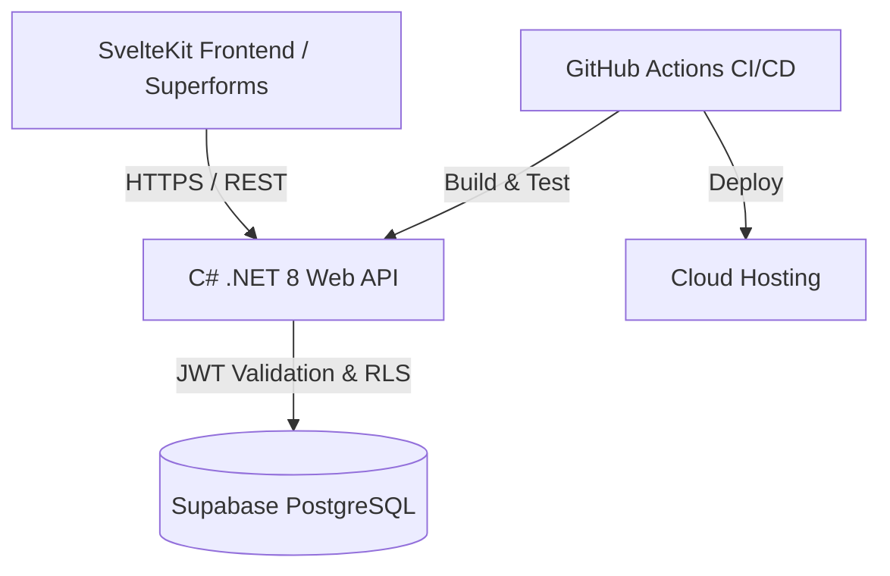

# Enterprise Resource & Metrics Dashboard

A multi-tenant, full-stack dashboard built with a **SvelteKit** client, a **C# .NET 8 Web API**, and a **Supabase (PostgreSQL)** database. Demonstrates server-side schema validation, JWT/OAuth authentication, and an automated GitHub Actions deployment pipeline.

---

## Architecture Overview



---

## Tech Stack

- **Frontend:** SvelteKit, Tailwind CSS, `sveltekit-superforms`, Zod (Validation)
- **Backend:** C# / .NET 8 Web API, ASP.NET Core Identity, JWT / OAuth 2.0
- **Database:** Supabase / PostgreSQL, Row Level Security (RLS)
- **DevOps & Tooling:** Docker, GitHub Actions CI/CD, Postman, Git

---

## Key Features

- **Type-Safe Form Handling:** Progressive enhancement via `sveltekit-superforms` paired with Zod schemas for client/server validation.
- **Role-Based Authorization:** Secure C# API endpoints using JWT bearer tokens and granular database RLS policies.
- **Real-time Metrics:** Dashboard metrics powered by cached API responses and streamed server updates.
- **Automated CI/CD:** GitHub Actions workflow executing unit tests, building Docker containers, and running lint checks on every push.

---

## Getting Started

### Prerequisites

- [.NET 8 SDK](https://www.google.com/search?q=https://dotnet.microsoft.com/download)
- [Node.js v18+](https://www.google.com/search?q=https://nodejs.org/)
- [Docker Desktop](https://www.google.com/search?q=https://www.docker.com/)

### 1. Backend Setup (.NET 8 API)

```bash
cd backend
dotnet restore
dotnet run

```

_The API will start locally at `https://localhost:7001`._

### 2. Frontend Setup (SvelteKit)

```bash
cd frontend
npm install
npm run dev -- --open

```

_The app will launch at `http://localhost:5173`._

---

## Environment Variables

Create a `.env` file in the `frontend` and `backend` root directories:

**Backend (`backend/appsettings.Development.json`):**

```json
{
  "ConnectionStrings": {
    "DefaultConnection": "YOUR_SUPABASE_POSTGRES_CONNECTION_STRING"
  },
  "Jwt": {
    "Secret": "YOUR_SUPER_SECRET_JWT_KEY",
    "Issuer": "https://localhost:7001"
  }
}
```

---

## License

Distributed under the MIT License. See `LICENSE` for details.
